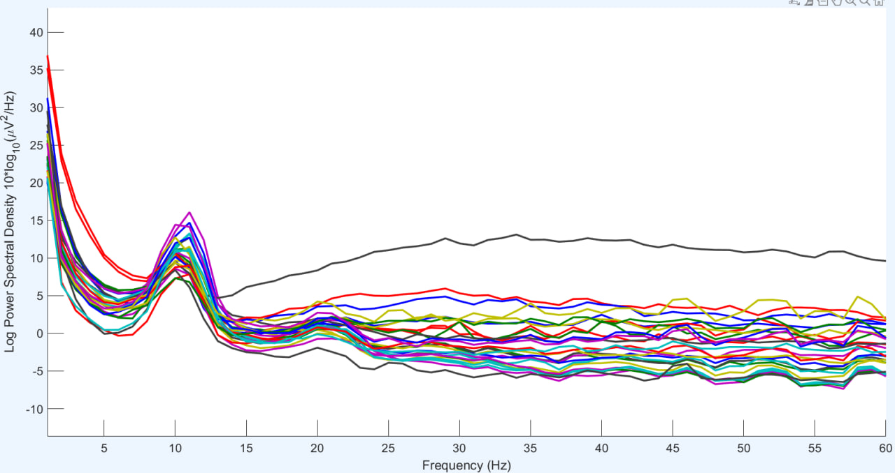
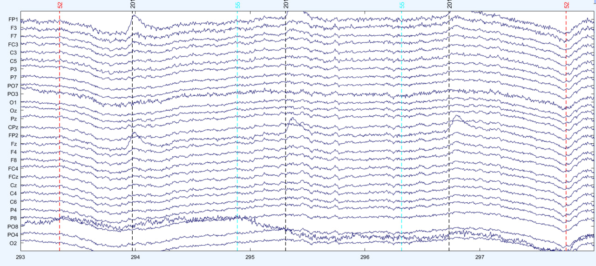
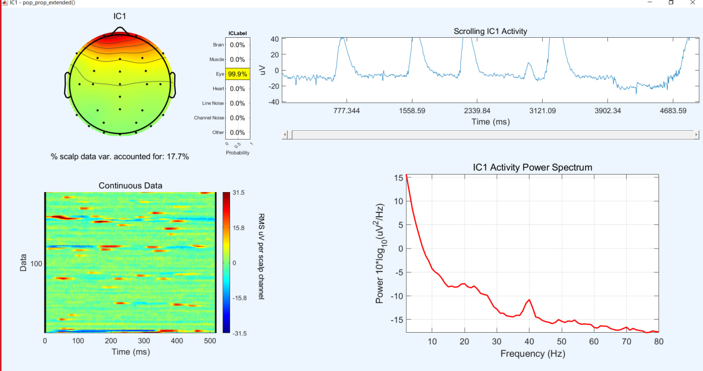
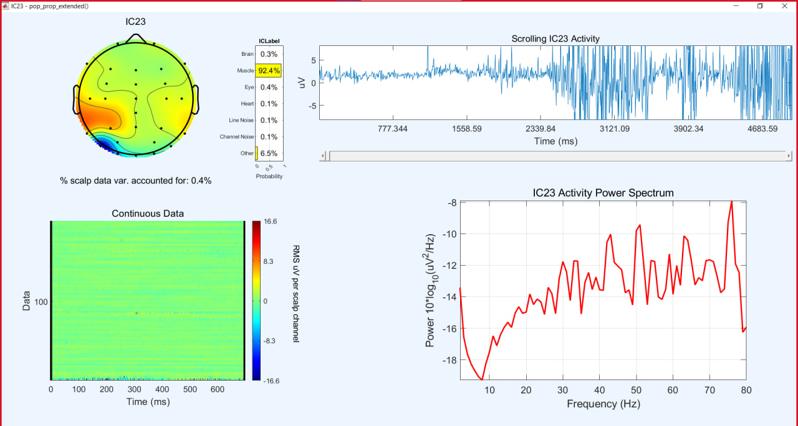
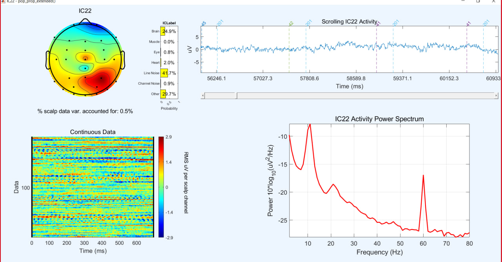
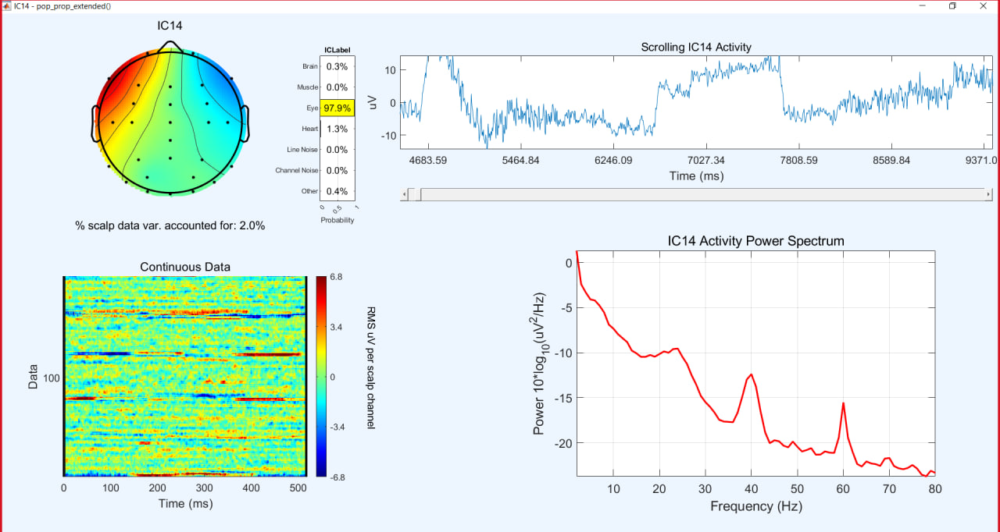
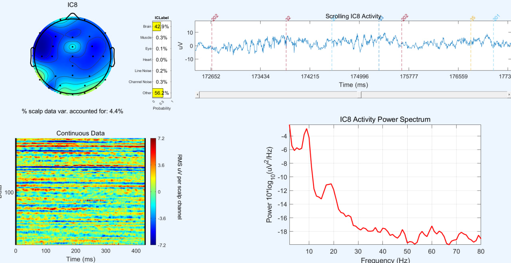
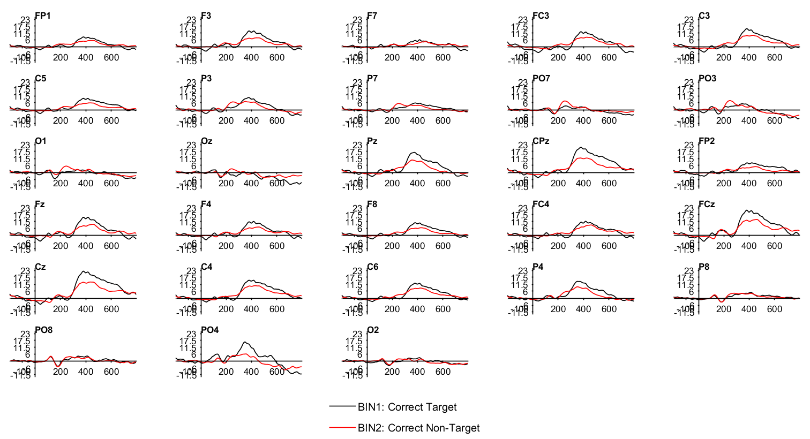

# Visual Oddball Task EEG Preprocessing

This repository contains the code and data for preprocessing and analyzing EEG data collected during a visual oddball task. The preprocessing includes artifact removal using Independent Component Analysis (ICA), event-related potential (ERP) analysis focusing on P3 and Error-Related Negativity (ERN) components, and statistical comparisons of ERP waveforms.

## Table of Contents
- [Introduction](#introduction)
- [Preprocessing Steps](#preprocessing-steps)
- [Bad Channel Identification](#bad-channel-identification)
- [Independent Component Analysis (ICA)](#independent-component-analysis-ica)
- [Event List and Epoching](#event-list-and-epoching)
- [ERP Analysis](#erp-analysis)
- 
## Introduction

This project focuses on preprocessing EEG data from a visual oddball task using MATLAB and the EEGLAB toolbox. The primary steps include loading the data, removing artifacts, and performing ERP analysis. The main goal is to study the P3 and ERN components, which reflect cognitive processing of targets and errors, respectively.

## Preprocessing Steps

### 1. Loading the Data
The EEG data is loaded from `.set` files for each subject. Channel locations and event markers are imported, and the data is prepared for further processing.

```matlab
% Initialize EEGLAB
[ALLEEG EEG CURRENTSET ALLCOM] = eeglab;
% Load the EEG data
EEG = pop_loadset('filename', eegSetFile);
```

### 2. Downsampling and Re-referencing
The data is downsampled to 256 Hz, and then re-referenced to the average of P9 and P10 electrodes to reduce noise.

```matlab
% Downsample to 256 Hz
EEG = pop_resample(EEG, 256);

% Re-reference to P9 and P10
EEG = pop_reref(EEG, {'P9', 'P10'});
```

### 3. Artifact Removal
Horizontal and vertical EOG channels are removed to reduce eye movement artifacts, and a high-pass filter of 0.1 Hz is applied.

```matlab
% Remove HEOG and VEOG channels
EEG = pop_select(EEG, 'nochannel', {'HEOG_left', 'HEOG_right', 'VEOG_lower'});

% Apply a high-pass filter
EEG = pop_eegfiltnew(EEG, 0.1, []);
```

## Bad Channel Identification

Bad channels are identified based on noise levels in both time and frequency domains. These channels are removed before further analysis.

### Example: Frequency-domain and time-domain analysis for Subject 1
- **Channel F8** was removed due to high-frequency noise.

### Image Placement: Frequency and Time-domain Plots
You can include pictures of the frequency and time-domain plots for different subjects, such as Subject 1 (high noise in channel F8) and Subject 9 (noisy channels PO8 and PO3) here.


*Figure 1: Frequency-domain plot for Subject 1 showing high noise in channel F8.*


*Figure 2: Time-domain plot for Subject 9 showing noise in channels PO8 and PO3.*

### Independent Component Analysis (ICA) and Artifact Removal

In this project, Independent Component Analysis (ICA) was used to identify and remove artifacts such as eye blinks, muscle movements, line noise, and other non-brain activity. Below are examples of artifacts identified and removed using ICA.

#### Example 1: Eye Blink Artifact
Eye blink artifacts are common and create large deflections, especially over the frontal electrodes. ICA helped identify the component responsible for these deflections, which was then removed.


*Figure 1: Scalp map and frequency/time-domain plots showing the eye blink artifact.*

#### Example 2: Muscle Artifact
Muscle artifacts, typically appearing as high-frequency noise, were identified and removed using ICA. These components were classified as non-brain sources based on their high-frequency signatures and scalp distribution.


*Figure 2: Scalp map and frequency/time-domain plots showing muscle artifact.*

#### Example 3: Line Noise Artifact
Line noise at 60 Hz can contaminate EEG signals. ICA was used to identify and remove this noise.


*Figure 3: Scalp map and frequency/time-domain plots showing line noise at 60 Hz.*

#### Example 4: Peak at 23 Hz (Not Typical 1/f Pattern)
An atypical peak at approximately 23 Hz was identified in the data, which is inconsistent with brain activity. ICA was used to remove this component.


*Figure 4: Scalp map and frequency/time-domain plots showing the atypical peak at 23 Hz.*

#### Example 5: Eye Movement Artifact
Eye movement artifacts typically show up as bilateral activity in the frontal electrodes. The rise and fall in the signal correspond to eye movements, which were identified and removed using ICA.


*Figure 5: Scalp map and frequency/time-domain plots showing the eye movement artifact.*

#### Example 6: Rhythmic Artifact
Rhythmic artifacts, typically non-brain-related oscillations, were identified in the data. These were removed as they did not match expected brain activity patterns.


*Figure 6: Scalp map and frequency/time-domain plots showing the rhythmic artifact.*


## Event List and Epoching

Event codes are assigned to the EEG data based on the visual oddball task paradigm. Bins are created for target and non-target conditions, and the data is epoched for P3 and ERN analysis.

```matlab
% Assign event codes
EEG = pop_creabasiceventlist(EEG, 'AlphanumericCleaning', 'on');
% Epoch the data
EEG_P3 = pop_epochbin(EEG, [-200.0 800.0], 'pre');
```

## ERP Analysis

ERP waveforms are computed for different conditions to analyze the P3 component, which is related to cognitive processing. The conditions compared are:
- **Correct Target (BIN1) vs Correct Non-Target (BIN2)**

The analysis focuses on the P3 component, which is typically strongest in central-parietal electrodes such as Fz, Cz, and Pz.

### P3 Component Analysis

The following figure shows the grand-averaged ERP waveforms for Correct Target (BIN1, black line) and Correct Non-Target (BIN2, red line) conditions across multiple electrodes. The differences in the P3 component are visible, particularly in the central-parietal electrodes (e.g., Fz, Cz, Pz), where the P3 amplitude is more pronounced in the Correct Target condition.


*Figure 1: Grand-averaged ERP waveforms for Correct Target (BIN1) and Correct Non-Target (BIN2) conditions across different electrodes.*

### Key Observations:
- **Fz, Cz, Pz**: The P3 component, a positive deflection around 300-500 ms post-stimulus, is clearly visible in these electrodes. The amplitude is higher in the Correct Target (BIN1) condition than in the Correct Non-Target (BIN2) condition, indicating stronger cognitive processing for target stimuli.
- **Parietal Electrodes (P3, P4, Pz)**: These electrodes also show a pronounced difference between the two conditions, with higher amplitudes for correct targets.
- **Frontal and Central Electrodes**: Electrodes such as Fz and Cz show the strongest P3 responses, in line with typical findings in ERP studies.

This analysis supports the typical finding that the P3 component is larger for target stimuli, reflecting heightened attentional and working memory processes.

